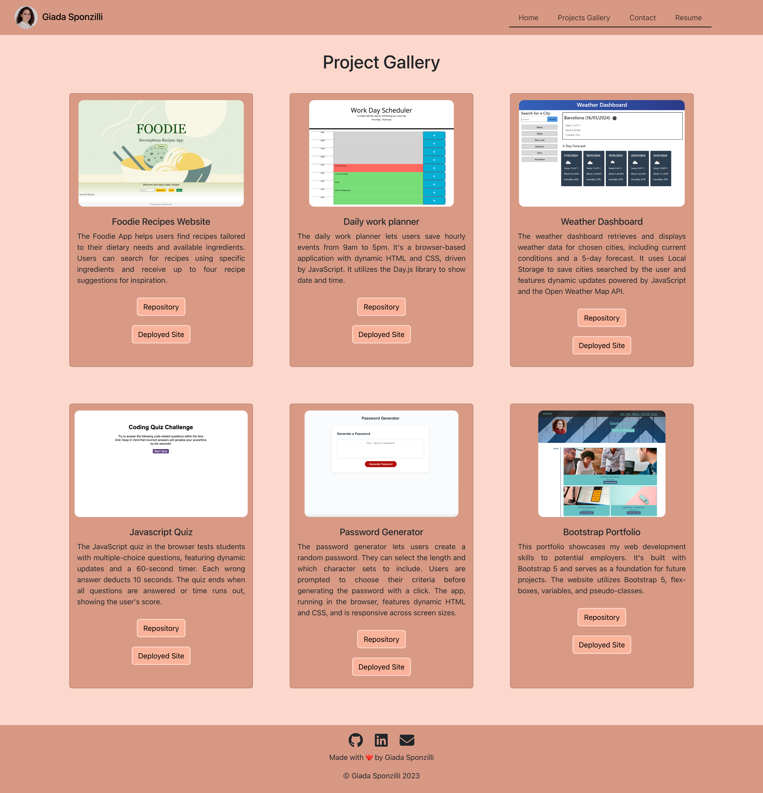
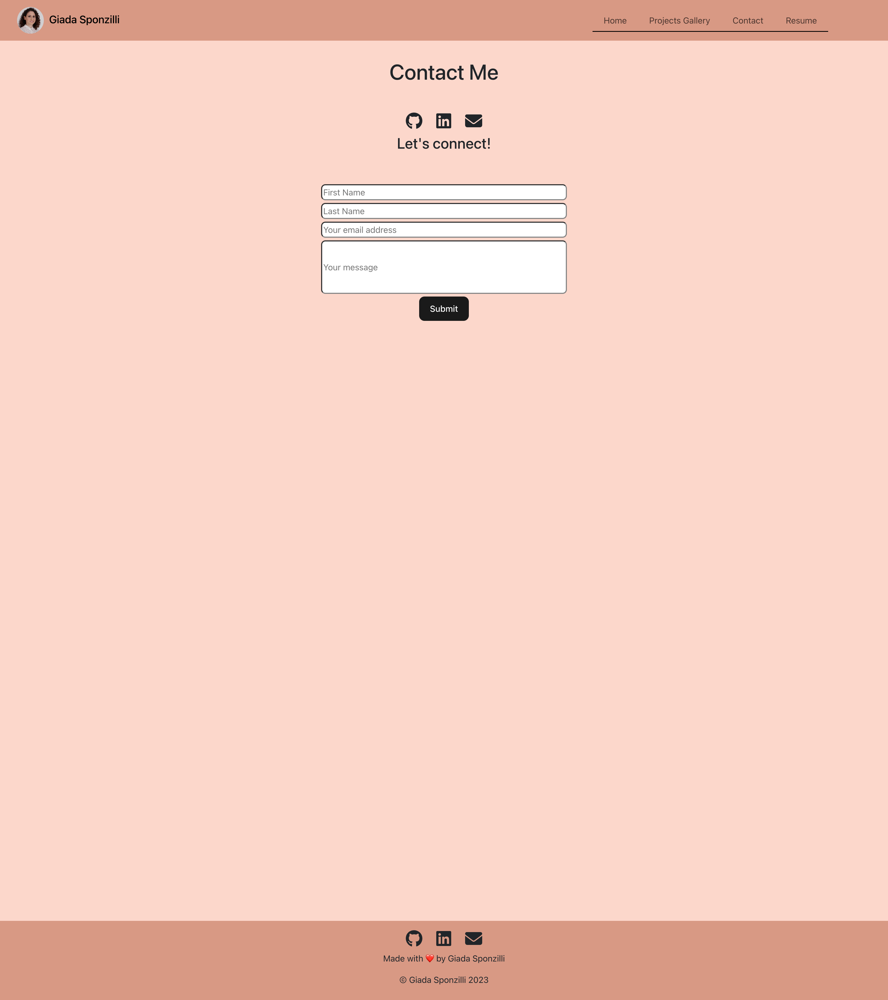

# react-portfolio-giadaSponzilli

## Description 
This project is a professionally crafted portfolio website developed using React + Vite, adhering to a mobile-first design approach. It incorporates React Router for seamless navigation and dynamic rendering of components. The design emphasizes a custom color palette to avoid generic Bootstrap themes, ensuring a polished and visually appealing user experience while prioritizing readability and accessibility.

Key Components:
  * App: The top-level component responsible for rendering all other necessary child components.
  * Header: A persistent component displayed across all pages, featuring a navigation bar for easy site traversal.
  * Footer: A persistent component displayed across all pages, featuring contact information for easy access across the site.
  * Home: The landing page welcomes visitors with the creator's name, a concise brand statement, and clear identification as a portfolio site.
  * Project Gallery: This component dynamically generates and displays project previews using data sourced from a JSON file, enabling easy scalability and maintenance.
  * Project: A reusable component designed to present detailed information about individual projects, including titles, links to deployed versions and GitHub repositories, and visual representations in the form of screenshots.
  * Contact: Provides visitors with contact information and features a functional form for interacting with the site owner.

Technologies Used:
  * React: The core framework used for building the entire application, facilitating the creation of reusable components and efficient state management.
  * React Router: Employed for client-side routing, enabling seamless navigation between different sections of the portfolio.
  * JSON Data Management: Project information is stored in a JSON file and imported into the application, promoting separation of concerns and ease of maintenance.
  * React Bootstrap: Styling is implemented with React Bootstrap, offering a diverse set of pre-designed UI components for efficient development. It prioritizes readability and visual appeal by adjusting font size and color contrast, while customization options enable alignment with project-specific needs.

The code is deployed at https://giadasponzilli.github.io/react-portfolio-giadaSponzilli/ 

## Table of Contents 
  * [Description](#description)
  * [Table of Contents](#tableOfContent)
  * [Screenshots](#screenshots)
  * [Installation](#installation)
  * [Usage](#usage)
  * [Credits](#credits)
  * [License](#license)
  * [Questions](#questions)
  * [Badges](#badges)

## Screenshots 

## Installation 
This code can be installed clicking on the "Code" green button above and git cloning the SSH to your local terminal.
When the project is open in you editor install all required packages by running:
`npm i`.
Once all packages are installed, you can start the development server by running: `npm run dev`.

## Usage 
This application serves as a comprehensive showcase of my skills and projects as a web developer, providing employers with a detailed overview of my capabilities and accomplishments.

## Credits 
React: https://react.dev/

Vite: https://vitejs.dev/ 

React Router: https://reactrouter.com/en/main

React Bootstrap: https://react-bootstrap.netlify.app/ 

Node.js: https://nodejs.org/en

Badges: https://shields.io/

## License 
This application is covered under the

## Questions 
For any additional questions please feel free to reach me at:
* https://github.com/giadasponzilli
* sponzilli.g@gmail.com

## Badges 

